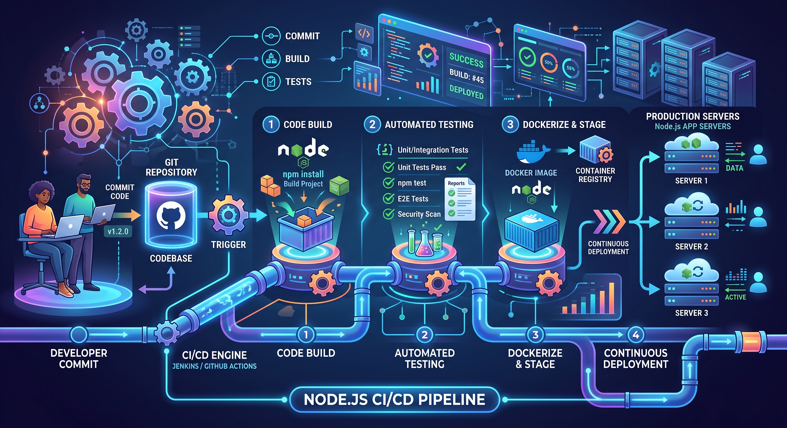

# Pipeline CI/CD Node.js (Jenkins & GitHub Actions)

Projeto Node.js utilizado para demonstrar uma pipeline de CI/CD, agora com integração de práticas DevSecOps através do GitHub Actions.



## Requisitos

* Node.js
* npm

## Instalação

Clone o repositório:

```bash
git clone <URL_DO_REPOSITORIO>
cd pipeline-jenkins-nodejs

```

Instale as dependências:

```bash
npm install

```

## Build

Execute o build:

```bash
npm run build

```

O comando apenas simula uma etapa de build e exibe uma mensagem de sucesso.

## Testes

Execute os testes automatizados:

```bash
npm test

```

Os testes utilizam **Jest** e **Supertest**.

## Execução

Inicie a aplicação:

```bash
npm start

```

O servidor será iniciado pelo ficheiro `server.js`.

## Comandos disponíveis

```bash
npm install    # Instala as dependências
npm run build  # Executa o build
npm test       # Executa os testes
npm start      # Inicia a aplicação

```

## Jenkins

O projeto pode ser utilizado numa pipeline Jenkins executando as etapas:

```text
Checkout → npm install → npm run build → npm test → npm start

```

## Integração DevSecOps com GitHub Actions (Novo)

O repositório inclui agora um fluxo de trabalho automatizado no GitHub Actions (`.github/workflows/pipeline.yml`) que integra testes de segurança contínuos na pipeline.

A nova ordem de execução garante um retorno rápido (*fail-fast*) em caso de vulnerabilidades:

1. **Checkout e Setup**: Preparação do ambiente Node.js.
2. **Install**: Instalação das dependências.
3. **SAST (Semgrep)**: Análise Estática de Segurança (Static Application Security Testing). Procura vulnerabilidades diretamente no código-fonte, sendo executada antes do build.
4. **Build**: Construção da aplicação.
5. **Test**: Execução dos testes automatizados.
6. **DAST (OWASP ZAP)**: Análise Dinâmica de Segurança (Dynamic Application Security Testing). A aplicação é iniciada em segundo plano (`npm start &`) para que a ferramenta OWASP ZAP Baseline possa realizar verificações de segurança interativas num ambiente a executar em `localhost:3000`.

### Relatórios de Segurança e Artefactos

A pipeline tem permissões avançadas de repositório configuradas para reportar falhas de forma automatizada. Ao final do fluxo de trabalho, o ZAP:

* Regista automaticamente as vulnerabilidades encontradas abrindo uma tarefa no separador **Issues** do GitHub.
* Gera um relatório detalhado (HTML, JSON e Markdown), que fica disponível para transferência com o nome `zap-scan-report` no separador **Artifacts** da respetiva execução da pipeline.

